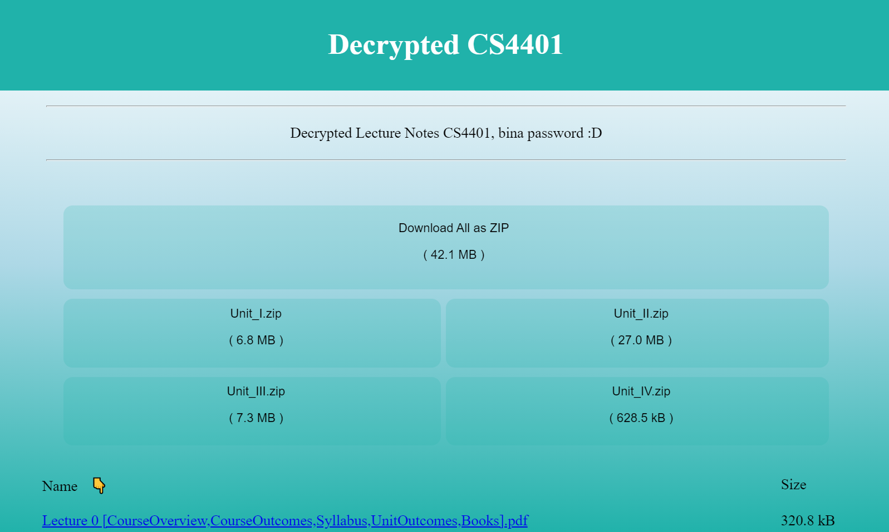
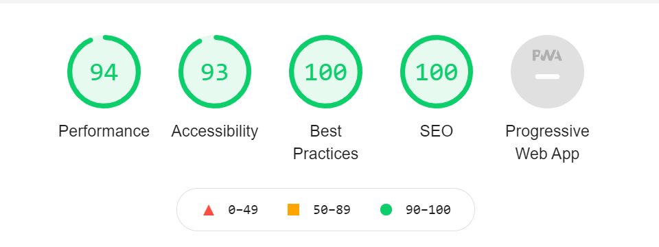

# Decrypted Lecture Notes

For the NITP 2k19-23 batch.

> **NOTE** - Kyunki sir ne pdfs ka access hata diya hai, so the website will not show the pdfs now, saare pdfs hai abhi bhi, lekin agar aapko pdfs chahiye to message ya mail kardena (ag15035@gmail.com)
>
>            You can still deploy this branch, or the button below, and it will show the pdfs again 🙂

[](https://gitpod.io/#https://github.com/adi-g15/CS4401)

Provides decrypted lecture notes, download and read, no need to always enter password.

> See the `src/pages/index.tsx` file for code, it is the main code for the page you see at https://cs4401.netlify.app

There are in-code comments, for any further issue/\`any\` doubt, raise an issue here or dm.

## Decrypting and Updating data

The site lists all pdf and zip files inside a google cloud storage bucket.
So we need some automation to automatically update the files inside it, with latest files added in the google drive folder.

This command handles it : 

```sh
python3 code.py
```

After this everything is automated, the steps in brief are:

1. Downloading new files from google drive folder
2. Decrypting pdfs
3. Creating zip (of Unit-I, Unit-II, ...)
4. Uploading updated files to google cloud storage
5. Then the website (rest of the code here) automatically displays the new data as available in the cloud storage

> An interesting change can be, modify Step 4 to upload to a google drive folder itself, instead of cloud storage, that way you won't even need this website, though i leave it as is, as for most, this website is much faster

All of this is automated, see the `code.py` file for more details and comments to how it is done :D



### Lighthouse statistics



Made for anyone who wishes to make it easier to get notes for all
